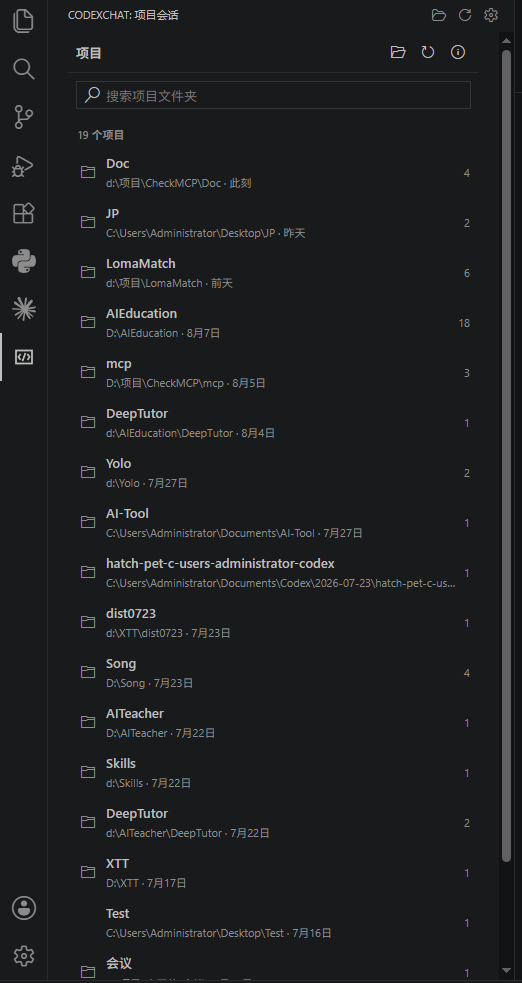
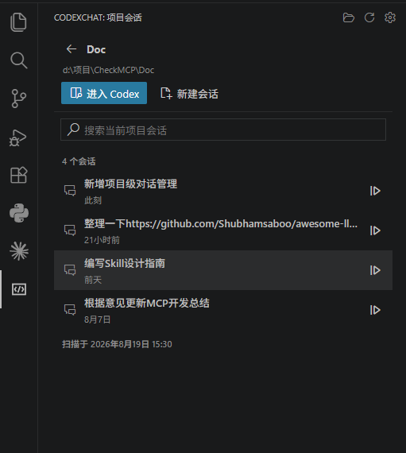
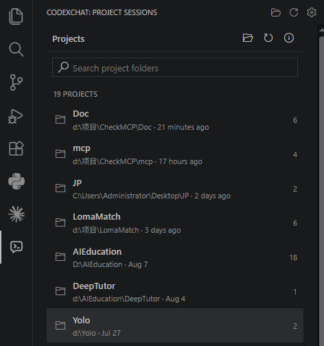
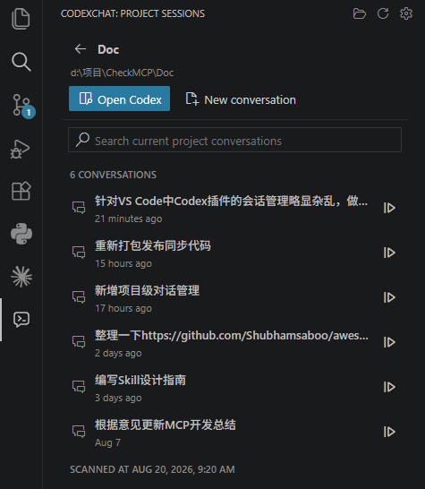

# CodexChat

CodexChat 是 OpenAI Codex VS Code 扩展的本地会话伴生管理器。它读取本机 `.codex` 数据目录，按会话中的 `cwd` 将历史会话归入项目文件夹。

## 功能

- 自动扫描 `sessions` 和 `archived_sessions`。
- 按项目文件夹浏览本地 Codex 会话。
- 查看用户消息、Codex 回复和工具调用摘要。
- 监听本地会话变化并刷新。
- 汇总每个项目的 Codex Token 使用量、平均会话消耗和输入/输出/推理拆分。
- 仅展示当前仍存在的项目路径，已删除路径不会计入 Token 统计。
- 打开项目工作区并进入官方 Codex 扩展。
- 在经过验证的 Codex 版本中恢复指定本地会话。
- Codex 原始会话文件全程只读。

## 使用

1. 打开 VS Code Activity Bar 中的 CodexChat。
2. 从自动识别的项目中选择一个项目，或使用文件夹选择器添加项目。
3. 点击会话查看只读内容。
4. 点击“进入 Codex”开始工作，或点击会话右侧的继续按钮恢复历史会话。
5. 点击工具栏中的统计图标查看按项目汇总的 Token 使用情况。

默认数据目录为当前用户目录下的 `.codex`。可通过 `codexChat.codexHome` 设置覆盖。

## 界面预览

### 项目会话



### 会话详情



## 开发

```powershell
npm.cmd install
npm.cmd test
npm.cmd run package
```

按 `F5` 可启动 Extension Development Host。

## 兼容性说明

`chatgpt.openSidebar` 是当前 OpenAI Codex 扩展公开注册的 VS Code 命令。指定历史会话的直接跳转依赖当前版本中的内部 `/local/:conversationId` 路由，CodexChat 仅对已验证版本启用，并在不兼容时降级为打开 Codex 侧栏和复制会话 ID。

---

# CodexChat English Version

CodexChat is a local session companion manager for the OpenAI Codex VS Code extension. It reads the local `.codex` data directory and groups historical conversations into project folders based on the `cwd` recorded in each session.

## Features

- Automatically scans `sessions` and `archived_sessions`.
- Browses local Codex conversations by project folder.
- Displays user messages, Codex responses, and tool-call summaries.
- Watches local session changes and refreshes automatically.
- Summarizes Codex token usage by project, including average conversation usage and input/output/reasoning breakdowns.
- Shows only project paths that still exist, excluding deleted paths from token totals.
- Opens the project workspace and enters the official Codex extension.
- Restores a selected local conversation in verified Codex versions.
- Keeps original Codex session files read-only throughout the workflow.

## Usage

1. Open CodexChat from the VS Code Activity Bar.
2. Select a project from the automatically detected projects, or add one with the folder picker.
3. Click a conversation to view its read-only content.
4. Click "Enter Codex" to start working, or click the continue button beside a conversation to resume a historical session.
5. Click the toolbar stats icon to review project-level token usage.

The default data directory is `.codex` under the current user's home directory. You can override it with the `codexChat.codexHome` setting.

## Interface Preview

### Project Sessions



### Conversation Details



## Development

```powershell
npm.cmd install
npm.cmd test
npm.cmd run package
```

Press `F5` to launch the Extension Development Host.

## Compatibility Notes

`chatgpt.openSidebar` is the VS Code command currently registered publicly by the OpenAI Codex extension. Directly jumping to a specific historical conversation depends on the internal `/local/:conversationId` route in the current version. CodexChat only enables this behavior for verified versions, and falls back to opening the Codex sidebar and copying the conversation ID when the route is incompatible.
