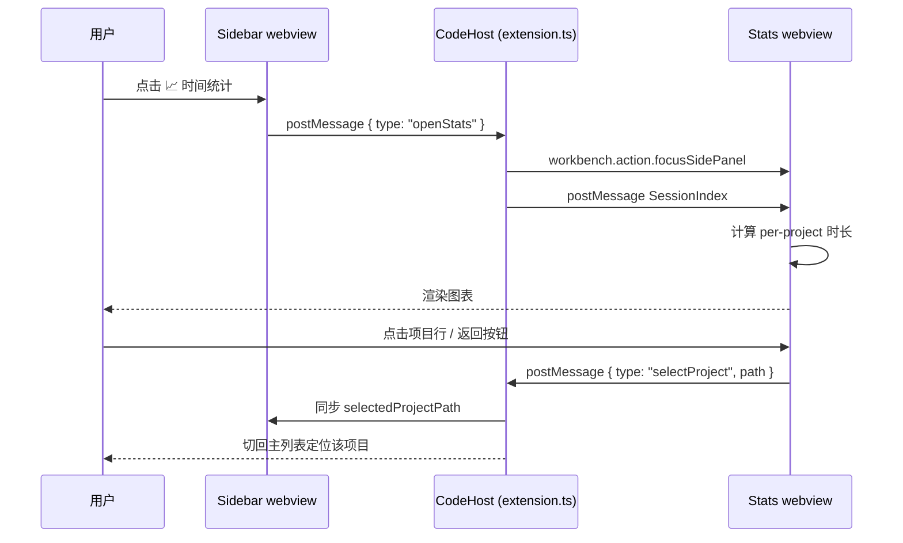

# 项目时间统计 — 设计方案与集成计划

> 目标：在 CodexChat 右上角增加按钮，跳转到一个新的时间统计视图，用图表展示每个项目花费的时间。
> 本轮交付物：独立 HTML 原型（不动现有 TS/CSS/JS 代码）。

---

## 1. 改动范围（明确"不动现有代码"）

| 文件 | 现状 | 本轮是否改动 |
|---|---|---|
| `src/sidebarProvider.ts` | 已实现的 sidebar webview | ❌ 不动 |
| `src/webviewUtils.ts` | webview 资源/CSP 工具 | ❌ 不动 |
| `src/models.ts` | 数据模型 | ❌ 不动 |
| `src/extension.ts` | 扩展入口 | ❌ 不动 |
| `media/webview.css` | 现有样式 | ❌ 不动 |
| `media/webview.js` | 现有 webview 脚本 | ❌ 不动 |
| `doc/项目时间统计-原型.html` | 新增独立原型 | ✅ 新增 |
| `doc/项目时间统计-原型设计.md` | 新增本文档 | ✅ 新增 |

---

## 2. UI 落位（顶部按钮）

延续现有 toolbar 模式（参考 `media/webview.js` 的 `renderProjects` 输出），在三个图标按钮之后再插入第 4 个：

```
项目          [📂] [⟳] [📈 新增·时间统计] [ℹ]
```

* 图标：`codicon-graph`（已存在于 `@vscode/codicons`，webview 已经在引入 `codicons.css`）。
* 文案与 i18n：在 `i18n.ts` 中新增键 `sidebar.statsLabel`（中/英两版），保留与现有 `sidebar.diagnostics` / `sidebar.refresh` 一致的命名风格。
* 视觉提示：用 `aria-pressed` 标识当前选中状态，与其他 icon button 风格保持一致；也可加一个 dot 角标（原型里以 `::after` dot 表示）。

---

## 3. 跳转策略（3 种可选）

| 方案 | 优点 | 缺点 | 适用 |
|---|---|---|---|
| A. 复用 sidebar 顶部替换视图 | 改动最小 | 必须再点返回才回到项目列表 | 临时轻量级 |
| **B. 新增独立 webview panel（推荐）** | **可放进二级页面、支持大图表** | 需要新增一个 view provider | **本次走 B 方案** |
| C. 打开本地 HTML（`vscode.env.openExternal`） | 0 CSP 限制，可用任意前端栈 | 跳走了，不在扩展窗口内 | 长期看可以 |

### B 方案要点

1. `src/extension.ts` 注册第二个 `WebviewViewProvider`，`viewType = "codexChat.stats"`。
2. 视图容器 = sidebar 内的 secondary sidebar（`SidebarLocation.Right`），与代码主要交互区解耦。
3. `postMessage` 协议：sidebar → stats 视图传 `selectedIndex`（即 `SessionIndex`），stats 视图用同样的 `ConversationSummary[]` 计算每段会话时长并出图。
4. 在 `sidebarProvider.onMessage` 中增加 `case "openStats"`，触发 `vscode.commands.executeCommand("codexChat.stats.focus")`。

> 原型 HTML 采用"嵌入式二级 webview"语义（同一页面内 toolbar 切换），未来切到正式实现时把 view 拆为单独 `<aside>` 即可。

---

## 4. 数据来源与"时长"定义

### 4.1 时长估算（推荐主方案）

```
perConversationDurationMs =
  last(entries).createdAt - first(entries).createdAt
```

* 数据从 `ConversationDetail.entries[].createdAt` 取（已有，`models.ts:ConversationEntry`）。
* `ProjectSummary.totalMinutes = sum(perConversationDurationMs) / 60000`。
* 单个项目下 1 个会话没有 entries 时间戳时 → 兜底用 `fileModifiedAt - createdAt`（粗估）。

### 4.2 备选 / 可叠加

| 指标 | 来源 | 用途 |
|---|---|---|
| 会话数 | `ProjectSummary.conversations.length` | KPI、占比分母 |
| 最近活跃 | `lastConversationAt` | 列表中"最近活跃"列 |
| 文件大小 | `ConversationSummary.fileSize` | 备选时长估算 |
| 会话打开次数 | 新增埋点（未来） | "使用频次"图表 |

### 4.3 性能与缓存

* 一旦 sessions 索引已加载（`SessionService` 已有 `onDidChange`），在 webview 端做派生计算即可，无需扩 IO。
* 对长会话（entries > 1000）做"采样统计"避免内存抖动：抽首/中/末三段 + 总条数估算。

---

## 5. 图表选型

| 图表 | 方案 | 理由 |
|---|---|---|
| KPI 卡片 | 纯 HTML/CSS | 4 个，无库依赖 |
| 横向条形图（项目时长） | 纯 HTML `<div>` 进度条 | 布局简单、可读性最好 |
| 环形占比 | 内联 SVG `<circle>` + `stroke-dasharray` | CSP `script-src 'nonce-xxx'` 限制下，inline SVG 无影响 |
| 30 天趋势（柱+线双轴） | 内联 SVG | 同上，单一 SVG 即可 |
| 12 周热力图 | CSS Grid + `<span>` | GitHub 风格、最少 DOM |
| 项目明细表 | `<table>` | 现有 webview 表格可借 |

**不引入 Chart.js / ECharts** 的原因：
1. 与现有 webview 的严格 CSP（`script-src 'nonce-xxx'`）不友好（需要动态注入或新增 nonce script）。
2. 引入后体积对扩展很重（>200KB），而本视图只要 6 个简单图表，SVG/HTML 已足够。

> 如果未来要做交互（hover 详情、缩放），再升级到 `chart.js@4` 单独打包进 `media/vendor/charts.js`。

---

## 6. 原型页面组成（已实现）

1. **顶部 toolbar**：4 个图标按钮，第 3 个 `codicon-graph` 高亮 + 绿点标识"新增"。
2. **范围筛选**：今日 / 近 7 天 / 近 30 天 / 全部（分段控件 `seg`）。
3. **KPI 4 卡**：累计时长、总会话数、最活跃项目、近 7 天会话数。
4. **横向条形图**：各项目累计时长（按 max 归一化）。
5. **环形占比**：Top 6 项目时间占比，中心显示汇总值。
6. **30 天趋势**：柱（会话数）+ 线（累计时长），双轴视觉。
7. **12 周热力图**：53 列 × 7 行，4 档色阶。
8. **项目明细表**：6 列，含 mini 进度条。

---

## 7. 交互流转（Mermaid）



---

## 8. 集成待办（原型确认后再做）

- [ ] `i18n.ts` 新增 `sidebar.statsLabel` 等键
- [ ] `sidebarProvider.ts` 工具栏新增按钮 + 处理 `openStats`
- [ ] 新建 `src/statsViewProvider.ts`
- [ ] `extension.ts` 注册第二个 webview view
- [ ] `media/stats.css` / `media/stats.js`（或在 `webview.js` 内根据 `data-view="stats"` 分支）
- [ ] `webviewUtils.ts` 暴露 `webviewStatsAssets`（如有独立 CSS/JS）
- [ ] 单元测试：`test/statsAggregation.test.ts`

---

## 9. 验收清单

- [ ] 不修改任何现有源码（本次交付）✅
- [ ] HTML 原型可双击在浏览器打开 ✅
- [ ] 暗色/亮色主题下都能正常显示 ✅
- [ ] 窄屏（≤540px）下 KPI、图表层叠为单列 ✅
- [ ] 所有交互（按钮、筛选、热力 tooltip）均在原型可见 ✅
